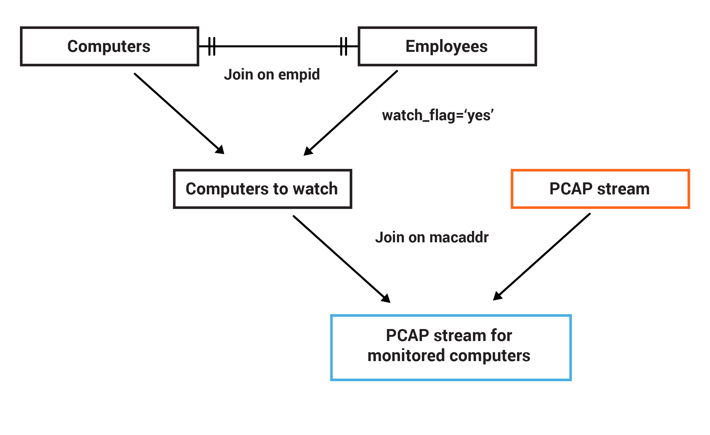

= Monitoring Network Activity by User

See http://www.confluent.io/stream-processing-cookbook/ksql-recipes/monitoring-network-activity

== Introduction

PCAP data is low-level data about network activity. PCAP data can be created from https://www.wireshark.org/[Wireshark] and its command line counterpart https://www.wireshark.org/docs/man-pages/tshark.html[tshark]. 

Using PCAP data, you can identify and monitor the behavior of applications and users on devices. This recipe is an example of how to filter PCAP data by MAC address. The MAC address on which to filter is derived from tables of employees and their computers. Employees with a "watch" flag against them will have their associated computer's MAC address used in the filter of the PCAP data. 

The resulting filtered stream of network activity can be used for monitoring and aggregated reports. 

== Prereqs: 

* Docker
* If running on Mac/Windows, at least 4 GB allocated to Docker: 
+
[source,bash]
----
docker system info | grep Memory 
----
+
_It should return a value greater than 8 GB—if not, the Kafka stack will probably not work._

== Try it at home!

Minimum version is Confluent Platform 5.0.1

1. Clone this repository:
+
[source,bash]
----
git clone https://github.com/confluentinc/ksql-recipes-try-it-at-home.git
----

2. Launch: 
+
[source,bash]
----
cd ksql-recipes-try-it-at-home/monitoring-network-activity
docker-compose up -d
----

3. Run KSQL CLI:
+
[source,bash]
----
docker-compose exec ksql-cli ksql http://ksql-server:8088
----

4. Create a table on the `employees` Kafka topic:
+
[source,sql]
----
CREATE TABLE employee_t \
            (key       VARCHAR, \
            name       VARCHAR, \
            watch_flag VARCHAR) \
      WITH (KAFKA_TOPIC ='employees', \
            VALUE_FORMAT ='JSON', \
            KEY='key');
----

5. Create a table on the `computers` Kafka topic: 
+
[source,sql]
----
CREATE TABLE computer_t \
            (comp_id INT, \
            empkey   VARCHAR, \
            macaddr  VARCHAR) \
      WITH (KAFKA_TOPIC='computers', \
            VALUE_FORMAT='JSON', \
            KEY='empkey');
----

5. Change a couple of system settings: 
+
* Any processing is to be done on the existing contents of a Kafka topic, not just new records
* When creating target topic, use one partition instead of the default four
+
[source,sql]
----
SET 'auto.offset.reset' = 'earliest';
SET 'ksql.sink.partitions'='1';
----

6. Create a new table showing the computer details for each employee who has been put on a "watch list." 
+
_Note that https://github.com/confluentinc/ksql/issues/1559[table-table joins are currently 1:1], not 1:N._
+
[source,sql]
----
CREATE TABLE COMP_WATCH_BY_EMP_ID_T \
      WITH (VALUE_FORMAT='AVRO') AS \
      SELECT c.empkey  AS EMP_ID,   \
             e.NAME    AS EMP_NAME, \
             e.key     AS EMP_KEY,  \
             c.macaddr AS MACADDR   \
      FROM computer_t c \
            INNER JOIN employee_t e \
            ON c.empkey = e.key \
      WHERE e.watch_flag='YES';
----
Verify that data is flowing to the new `COMP_WATCH_BY_EMP_ID_T` table: 
+
[source,sql]
----
SELECT * FROM COMP_WATCH_BY_EMP_ID_T LIMIT 1;
----

7. We will be joining the `COMP_WATCH_T` table to a stream of events using the common key of `MACADDR`. The table currently is keyed on the key that was being used in the join—employee ID. We need to re-key the data on `MACADDR` instead.
+
[source,sql]
----
CREATE STREAM COMP_WATCH_BY_EMP_ID_S WITH (VALUE_FORMAT='AVRO',KAFKA_TOPIC='COMP_WATCH_BY_EMP_ID_T');

CREATE STREAM COMP_WATCH_BY_MACADDR_S AS \
      SELECT * FROM COMP_WATCH_BY_EMP_ID_S \
      PARTITION BY MACADDR;
----
+
Verify that data is flowing to the new `COMP_WATCH_BY_MACADDR_S` stream: 
+
[source,sql]
----
SELECT * FROM COMP_WATCH_BY_MACADDR_S LIMIT 1;
----
+
[source,sql]
----
CREATE TABLE COMP_WATCH_BY_MACADDR_T WITH (VALUE_FORMAT='AVRO', \
                                           KEY='MACADDR',\
                                           KAFKA_TOPIC='COMP_WATCH_BY_MACADDR_S');
----

9. Register a KSQL stream on the `pcap` Kafka topic. The schema has many columns; only a subset are declared here. This is a valid approach to take with KSQL, and it will just ignore columns that are not declared. 
+
[source,sql]
----
CREATE STREAM PCAP (_index VARCHAR,                                  \
                    _type VARCHAR,                                   \
                    _score VARCHAR,                                  \
                    _source STRUCT<                                  \
                        layers STRUCT<                               \
                            frame STRUCT<                            \
                                encap_type VARCHAR,                  \
                                time VARCHAR,                        \
                                offset_shift VARCHAR,                \
                                time_epoch VARCHAR,                  \
                                time_delta VARCHAR,                  \
                                time_delta_displayed VARCHAR,        \
                                time_relative VARCHAR,               \
                                number VARCHAR,                      \
                                len VARCHAR,                         \
                                cap_len VARCHAR,                     \
                                marked VARCHAR,                      \
                                ignored VARCHAR,                     \
                                protocols VARCHAR>,                  \
                            eth STRUCT<                              \
                                dst VARCHAR,                         \
                                dst_tree STRUCT<                     \
                                    dst_resolved VARCHAR,            \
                                    addr VARCHAR,                    \
                                    addr_resolved VARCHAR,           \
                                    lg VARCHAR,                      \
                                    ig VARCHAR>,                     \
                                src VARCHAR,                         \
                                src_tree STRUCT<                     \
                                    src_resolved VARCHAR,            \
                                    addr VARCHAR,                    \
                                    addr_resolved VARCHAR,           \
                                    lg VARCHAR,                      \
                                    ig VARCHAR>,                     \
                                type VARCHAR>,                       \
                            ip STRUCT<                               \
                                version VARCHAR,                     \
                                hdr_len VARCHAR,                     \
                                dsfield VARCHAR,                     \
                                dsfield_tree STRUCT<                 \
                                    dscp VARCHAR,                    \
                                    ecn VARCHAR>,                    \
                                len VARCHAR,                         \
                                id VARCHAR,                          \
                                flags VARCHAR,                       \
                                flags_tree STRUCT<                   \
                                    rb VARCHAR,                      \
                                    df VARCHAR,                      \
                                    mf VARCHAR,                      \
                                    frag_offset VARCHAR>,            \
                                ttl VARCHAR,                         \
                                proto VARCHAR,                       \
                                checksum VARCHAR,                    \
                                status VARCHAR,                      \
                                src VARCHAR,                         \
                                addr VARCHAR,                        \
                                src_host VARCHAR,                    \
                                host VARCHAR,                        \
                                dst VARCHAR,                         \
                                dst_host VARCHAR>,                   \
                            udp STRUCT<                              \
                                srcport VARCHAR,                     \
                                dstport VARCHAR,                     \
                                port VARCHAR,                        \
                                length VARCHAR,                      \
                                checksum VARCHAR,                    \
                                status VARCHAR,                      \
                                stream_ VARCHAR>,                    \
                            bootp STRUCT<                            \
                                bootp_type VARCHAR,                  \
                                bootp_len VARCHAR,                   \
                                bootp_hops VARCHAR,                  \
                                bootp_id VARCHAR,                    \
                                bootp_secs VARCHAR,                  \
                                bootp_flags VARCHAR,                 \
                                bootp_flags_tree STRUCT<             \
                                    bootp_bc VARCHAR,                \
                                    bootp_reserved VARCHAR>,         \
                                bootp_client VARCHAR,                \
                                bootp_your VARCHAR,                  \
                                bootp_server VARCHAR,                \
                                bootp_relay VARCHAR,                 \
                                bootp_mac_addr VARCHAR,              \
                                bootp_addr_padding VARCHAR,          \
                                bootp_file VARCHAR,                  \
                                bootp_dhcp VARCHAR,                  \
                                bootp_cookie VARCHAR,                \
                                bootp_option_type VARCHAR,           \
                                bootp_option_type_tree STRUCT<       \
                                    bootp_option_end VARCHAR>,       \
                                bootp_option_padding VARCHAR>        \
                            >                                        \
                        > )                                          \
                WITH (KAFKA_TOPIC='pcap',                            \
                      VALUE_FORMAT='JSON');
----

10. Flatten the PCAP data, using just the particular fields of interest: 
+
[source,sql]
----
CREATE STREAM PCAP_FLAT WITH (VALUE_FORMAT='AVRO')    AS             \
      SELECT _SOURCE -> LAYERS -> FRAME -> TIME       AS FRAME_TIME, \
             _SOURCE -> LAYERS -> FRAME -> LEN        AS FRAME_LEN,  \
             _SOURCE -> LAYERS -> FRAME -> PROTOCOLS  AS FRAME_PROTOCOLS, \
             _SOURCE -> LAYERS -> ETH -> SRC          AS ETH_SRC,    \
             _SOURCE -> LAYERS -> ETH -> DST          AS ETH_DST,    \
             _SOURCE -> LAYERS -> IP -> SRC           AS IP_SRC,     \
             _SOURCE -> LAYERS -> IP -> DST           AS IP_DST,     \
             _SOURCE -> LAYERS -> IP -> SRC_HOST      AS IP_SRC_HOST,\
             _SOURCE -> LAYERS -> IP -> DST_HOST      AS IP_DST_HOST,\
             _SOURCE -> LAYERS -> IP -> PROTO         AS IP_PROTO   \
      FROM   PCAP;
----

11. Join the stream of PCAP data to the table of employees on the `watch list`: 
+
[source,sql]
----
CREATE STREAM WATCHED_EMP_NETWORK_TRAFFIC AS \
      SELECT * \
      FROM PCAP_FLAT P \
            INNER JOIN COMP_WATCH_BY_MACADDR_T C \
            ON P.ETH_SRC = C.MACADDR;
----

12. View the joined stream of data: 
+
[source,sql]
----
ksql> SELECT C_EMP_NAME, P_FRAME_PROTOCOLS, P_IP_DST FROM WATCHED_EMP_NETWORK_TRAFFIC;
Tom Jones | eth:ethertype:ip:udp:bootp | 255.255.255.255
Tom Jones | eth:ethertype:ip:udp:bootp | 255.255.255.255
Tom Jones | eth:ethertype:arp | null
Tom Jones | eth:ethertype:ip:tcp | 86.66.0.227
Tom Jones | eth:ethertype:ip:icmp:data | 86.64.145.29
Tom Jones | eth:ethertype:ip:tcp | 86.66.0.227
Tom Jones | eth:ethertype:ip:tcp:http | 86.66.0.227
Tom Jones | eth:ethertype:ip:tcp | 86.66.0.227
----

13. Optionally, filter the data further: 
+
[source,sql]
----
ksql> SELECT C_EMP_NAME, P_FRAME_PROTOCOLS, P_IP_DST FROM WATCHED_EMP_NETWORK_TRAFFIC WHERE P_FRAME_PROTOCOLS LIKE '%http';
Tom Jones | eth:ethertype:ip:tcp:http | 86.66.0.227
Tom Jones | eth:ethertype:ip:tcp:http | 17.252.60.23
Tom Jones | eth:ethertype:ip:tcp:http | 10.5.60.53
----
+
Press Ctrl-C to cancel the `SELECT` statement.
